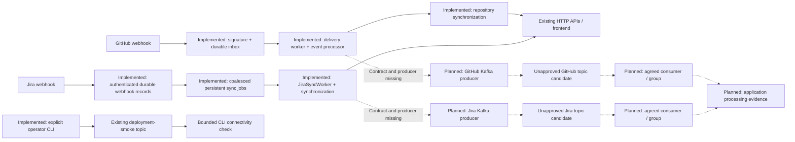

# Kafka topics and event flows

Reviewed 2026-10-09 against backend baseline `acd1445fb31fc7e445fdf1ea1f5734769bd069f3`.
DEVOPS-4.1 infrastructure is reused. This task changes local source only; no Azure operation,
topic creation, broker restart, deployment, project commit or push was performed.

## Current architecture and contracts

Neither GitHub nor Jira contains a Kafka client, producer, consumer, message contract or
approved Kafka subscription. The user has offered to provide approved contracts; their
contents have not yet been supplied. Provider webhook models are not Kafka contracts.
The proposed application topic names below must not be provisioned or enabled until reviewed.



Solid paths exist in source; dashed paths await developers. Kafka checks cannot demonstrate
GitHub/Jira business processing. The frontend continues using its existing HTTP APIs and
contains no broker credentials or Kafka connection.

GitHub paths:

- `Controllers/GitHubWebhooksController.cs` → `GitHubWebhookIngressService.AcceptAsync`:
  bounded request, signature and headers, payload hash, durable delivery record, local wakeup.
- `GitHubWebhookDeliveryWorker` claims received/failed/stale deliveries, maintains a lease,
  calls `GitHubWebhookEventProcessor.ProcessAsync`, and synchronizes distinct linked
  repositories through `IGitHubRepositorySynchronizationService.SynchronizeAsync`.
  Supported provider events include push, PR/review/comment, repository, installation and
  installation-repositories. Ping and unsupported events are ignored. This selection does
  not approve any of these events for Kafka publication.
- Failures retain the existing maximum-attempt/permanent-failure handling and retry delays
  of 30 seconds, 2 minutes, 10 minutes, 30 minutes and then 1 hour.
- Separate `RepositorySyncQueue`/`RepositorySyncWorker` handle process-local queued/coalesced
  sync requests; `GitHubReconciliationWorker` handles periodic reconciliation.

Jira paths:

- `Controllers/JiraWebhooksController.cs` → `JiraWebhookService.ReceiveAsync`: authentication,
  provider payload parsing, connection/project mapping, delivery deduplication and durable
  webhook records; accepted projects are scheduled with `IJiraSyncScheduler`.
- `JiraSyncScheduler` creates/coalesces persistent jobs. `JiraSyncWorker` claims jobs, calls
  `IJiraSyncService.SynchronizeAsync`, then marks jobs and covered webhook records completed
  or failed. Existing auth failures and the five-attempt limit are preserved. Retry delays
  are 30 seconds, 2 minutes, 5 minutes and then 15 minutes.
- `Domain/JiraWebhookEvent.cs` records provider delivery, project/cloud/issue identifiers,
  payload, status, attempts and timestamps. It is an inbox entity, not an agreed Kafka schema.

Both feature-registration extensions retain their existing workers and persistence. Only
optional transport settings are added at startup. No business handler has been replaced.

## Registry and policy

Authoritative file: `deploy/azure/vm/kafka/topics.json`. Naming for new application topics:
`researchtrack.<domain>.<event-category>.v<major-version>`. Preserve the established smoke name.

| Topic | Purpose / contract | Producer owner | Consumer / group | Partitions | RF | Retention | Status |
|---|---|---|---|---:|---:|---:|---|
| `researchtrack.deployment-smoke` | Unique UTF-8 probe token; operational v1 | DevOps CLI | Bounded CLI partition/offset assignment; no application group | 1 | 1 | 24h | Approved existing operational definition; current live state unverified |
| `researchtrack.github.events.v1` | PROPOSED; event, payload, key and schema await agreement | GitHub team proposed | Unknown; group unset | 1 proposed | 1 | 72h proposed | Unapproved; excluded |
| `researchtrack.jira.events.v1` | PROPOSED; event, payload, key and schema await agreement | Jira team proposed | Unknown; group unset | 1 proposed | 1 | 72h proposed | Unapproved; excluded |

RF1 matches the single broker and offers no broker redundancy. One partition is sufficient
for operational probes and a conservative starting proposal for this assignment. Developers
must agree throughput, key-based ordering and parallelism before approving application
partition counts. Smoke retention matches DEVOPS-4.1; 72h is only an application proposal,
consistent with the current broker default. No topic uses indefinite retention.

Every entry includes domain, description, producer/consumer ownership, group (nullable for
producer-only/CLI use), partitions, RF, retention, contract version/reference and approval.
Unapproved definitions may leave contract/consumer fields null. Approved definitions require
consumer ownership and a nonempty contract version/reference. The manifest is an operator
approval boundary: setting `approved: true` requires a reviewed contract, not an automated guess.

Before approving either application entry record: event/source, producer, intended consumer,
topic, purpose, schema/reference, version, key/ordering, delivery guarantee, retry/exhaustion,
offset commit, idempotency, expected processing result, and development owners. Choose
whether publication is coupled through an outbox to existing durable acceptance/processing;
DevOps does not choose this business transaction boundary.

## Optional runtime configuration

Only GitHub/Jira compile the shared `src/BuildingBlocks/Kafka/KafkaRuntimeOptions.cs`
source through explicit linked compile items. Its singleton
`KafkaRuntimeOptions` binds ASP.NET Core `Kafka` keys, validates enabled settings, and
materializes CA trust before startup. It registers **no Kafka client or hosted consumer**.
Defaults and `appsettings.json` keep Kafka disabled. Older service env bundles with no
Kafka keys remain valid. Enabling settings cannot make the current services publish events.

| Environment key | Meaning / enabled requirements |
|---|---|
| `Kafka__Enabled` | `false` until contracts and actual clients are reviewed; missing means false |
| `Kafka__BootstrapServers` | Comma-separated `host:port`; environment supplied |
| `Kafka__SecurityProtocol` | `SSL`; plaintext and SASL are not the current listener contract |
| `Kafka__SslCaLocation` | Absolute readable CA file; production `/tmp/researchtrack-kafka/ca.crt` |
| `Kafka__SslCaCertificateBase64` | Base64 of **one public CA PEM certificate only**; mandatory in production |
| `Kafka__EnableSslCertificateVerification` | `true` |
| `Kafka__SslEndpointIdentificationAlgorithm` | `https`, including certificate broker identity verification |
| `Kafka__Topic` | Approved registry topic for this service's domain |
| `Kafka__ContractVersion` | Exact approved registry contract version |
| `Kafka__ConsumerGroupId` | Empty for a producer-only role; if supplied, exact approved group |

Local: external TLS listener such as `localhost:19092`, certificate with matching SAN,
and a mounted public CA at an absolute container path or Base64 delivery. Test: its own
external TLS endpoint such as `test-kafka.internal:9092`, own CA and reviewed topic/group.
Production: `<VM_RFC1918_PRIVATE_IP>:9092` with that IP in the broker certificate SAN and
the existing VM public CA. Production permits only RFC1918 IPv4 endpoints on 9092, matching
the deployed private-IP broker architecture; it rejects public/loopback/Docker-internal values.
Port 29092 is rejected in all enabled service environments.

Set per-environment values in existing GitHub Environment service env secrets after review.
Do not paste production secrets into example files. Examples intentionally leave endpoint,
topic, version, group and CA empty while disabled.

### Trust delivery and client handoff

The existing production workflow writes `github.env` and `jira.env`, validates them, and
the existing deployer composes them with `shared-auth.env`. The renderer repeats Kafka
validation before producing app/job specs, and maps CA Base64 to a Container App `secretRef`.
The existing Bicep secure `secrets` parameter delivers the material; no Bicep, ingress,
listener, NSG, credential or image-entrypoint change is needed. Desired-spec hashing already
includes secrets so a changed CA rolls the affected revision on a later authorized deployment.

On enabled application startup, the helper decodes and validates a single currently valid
CA certificate, rejects private keys/non-CA/expired/future/invalid PEM, writes it atomically
with owner read/write permissions, and clears Base64 from the returned options. The file is
available at `SslCaLocation` before any future client is registered. Restart repeats delivery
from runtime configuration; it performs no topic operation. Local/Test may instead mount an
existing CA, which startup must actually read and validate. This does not add trust globally
to unrelated outbound HTTPS clients. Container filesystem delivery is tested in .NET;
execution of the built container and Azure revision remains unverified locally.

Developers must inject the singleton and map it into their selected Kafka library. For
Confluent/librdkafka use `bootstrap.servers`, `security.protocol=SSL`, `ssl.ca.location`,
`enable.ssl.certificate.verification=true`, `ssl.endpoint.identification.algorithm=https`,
and `allow.auto.create.topics=false`. A consumer must require its agreed group and define
offset/error semantics; no default group is invented. Client retry, acknowledgements,
idempotence and processing semantics belong in approved implementation, not these transport
options. Consult [official librdkafka configuration](https://docs.confluent.io/platform/current/clients/librdkafka/html/md_CONFIGURATION.html)
for these client settings. No Kafka NuGet dependency was added before library agreement.

Deployment image impact follows the existing linked-file model: this shared source is
compiled only into GitHub and Jira, so it affects only those images. The solution and common
API library remain unchanged. Environment changes affect only the service env files supplied.

## Topic operations and deployment lifecycle

Requirements: Bash, jq, GNU timeout and existing Compose/broker CLI. VM provisioning already
installs these tools. From the repository, `validate-manifest` needs only jq and no broker.
On the installed VM use:

```bash
cd /opt/researchtrack
scripts/kafka-topics.sh validate-manifest
scripts/kafka-topics.sh reconcile                 # default dry run, read-only
scripts/kafka-topics.sh reconcile --dry-run
scripts/kafka-topics.sh reconcile --check         # nonzero for missing topics or drift
scripts/kafka-topics.sh list
scripts/kafka-topics.sh describe researchtrack.deployment-smoke
scripts/kafka-topics.sh config researchtrack.deployment-smoke
```

With separate operator authorization after manifest review:

```bash
scripts/kafka-topics.sh reconcile --apply
scripts/kafka-topics.sh reconcile --check
```

Reconciliation validates before querying the broker, ignores unapproved topics, inspects
all approved existing topics before creating any, checks partition/RF and effective retention
using `kafka-configs --describe --all`, and refuses drift. Dry run lists missing definitions;
check returns nonzero for missing definitions. Apply uses existing `create --if-not-exists`
and verifies requested settings, then checks the registry again. Each broker command is
bounded. No delete, alter, partition increase or topic recreation occurs. Review drift with
owners and update the approved plan separately; the tool does not repair it. Sequential
creation can partially succeed if a later operation fails; repeat after resolving the failure.
Concurrent administrative changes may also produce a failed post-check; no destructive rollback.

The bundle builder validates the registry and packages it plus the jq validator and existing
topic CLI. The installer checks required files and validates without contacting Kafka. Normal
VM reconciliation, application deploy, migration and startup never invoke topic apply.
Use dry run after a reviewed bundle installation, then authorize apply independently.
Topics reside in existing persistent broker storage, independent of application lifetimes.
For later authorized application restarts, capture `list`/`--check` before and after;
do not invoke topic creation as a restart step. No live persistence check was executed here.

## Connectivity and application verification

1. Verify VM private publication/CA/SAN/storage with existing `scripts/verify-kafka.sh --check`.
2. After separate authorization for smoke writes, use `--smoke` and the existing
   `network-probe.sh` for Container Apps → VM connectivity. The latter provisions/runs an
   Azure diagnostic job and writes an operational token: it is not a read-only Azure action.
3. Inspect the affected Container App's env **names and secret references only**. Confirm
   the enabled revision started and `/tmp/researchtrack-kafka/ca.crt` is readable by its user.
4. Treat these results as transport evidence only. No current GitHub/Jira Kafka flow can
   be demonstrated until the following developer handoff is fulfilled.

GitHub demonstration after development:

1. Approve the exact selected GitHub event/schema/key, transaction boundary, producer,
   consumer/group, retry/offset semantics and expected result. Update registry and env values.
2. Run real producer/consumer integration in an isolated environment with a contract-valid
   synthetic event and correlation ID; avoid real repository mutations or production webhooks.
3. Capture the producer broker acknowledgement/topic/partition/offset, intended consumer
   receipt with matching key/version/payload, and a deterministic application processing
   assertion (state/API/record appropriate to the agreed contract).
4. Re-deliver and exercise failure/retry/commit cases per the contract; run existing webhook
   and sync tests. Verify no unintended duplicate processing or lost accepted work.

Jira demonstration uses the same sequence with the agreed Jira producer and consumer,
synthetic project/issue identity and contract-defined processing assertion. Do not trigger
real Jira updates. Neither demonstration has executable application commands yet because
no producer/consumer/test entrypoint or agreed schema is available. Developers must provide
those exact entrypoints; documenting a fabricated publish command would hide the dependency.
Existing CLI smoke is a separate token connectivity test, never application flow evidence.

## Troubleshooting

| Symptom | Inspect / next action |
|---|---|
| Missing topic | Validate manifest; run dry run/check; inspect approval; authorize apply separately |
| Topic mismatch | Read partitions/RF/effective retention; owner review; no automatic alterations |
| Bad bootstrap / producer timeout | Check the service's environment endpoint, RFC1918:9092 in production, routing/NSG, and broker availability |
| Consumer cannot connect / TLS failure | Confirm CA secretRef, readable delivered file, current CA, matching private-IP SAN, SSL and identity verification; never disable checks |
| Missing env settings / failed startup | Enabled settings require endpoint/topic/version/trust; older disabled bundles are valid; errors report key names |
| No events / empty topic | Confirm a real approved producer exists, broker acknowledgement and topic mapping; webhook acceptance alone publishes nothing |
| Wrong group / no consumer receipts | Inspect approved subscription/group, committed offsets, partition assignment and producer topic/key |
| Invalid contract | Compare schema/version/key with the referenced agreement; handle failures through approved developer policy |
| Deployment missing configuration | Check service env composition, validator, rendered env names/secretRef, image provenance and active revision |
| Consumer error after app restart | Confirm CA redelivery, persistent broker topics and consumer offset/retry recovery; do not recreate topics |

## Responsibility and acceptance

| Owner | Responsibilities |
|---|---|
| DevOps | Registry/tooling, explicit topic provisioning, env contracts/validation, public CA delivery, deployment consistency, private networking and infrastructure evidence |
| GitHub developers | Event selection/schema/key, producer publication/outbox decision, exact consumer/processing owner, retry/idempotency/offset semantics and real integration test |
| Jira developers | Equivalent Jira contract and clients, durable sync integration, processing result and real integration test |
| Intended consumer teams | Subscription/group approval, schema compatibility, offset/failure behavior and observable processing result |
| Operator | Review local changes, supply contracts, separately authorize deployment/topic apply/probes and retain live evidence |

See [task report](KAFKA_TOPICS_TASK_REPORT.md) for actual test results and requirement statuses,
and [existing Kafka operations](KAFKA_OPERATIONS.md) for broker/network/restart procedures.
