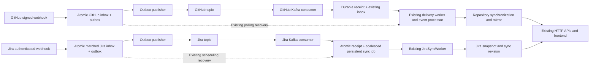

# Kafka topics and ResearchTrack event flows

Updated 2026-10-10. The owner approved the same-service webhook-reference contracts for
local implementation. Real Confluent.Kafka producers/consumers are now implemented.
Kafka remains disabled by default. No production enablement or topic write was performed.
Contract authority: [approved contract](KAFKA_CONTRACT_PROPOSAL.md).
Evidence: [task report](KAFKA_TOPICS_TASK_REPORT.md).

## Architecture and lifecycle boundary



Kafka transports references to accepted database records, with no raw provider payload.
The receiving service owns the same inbox/outbox. It validates identity and hands off to
existing durable work. A committed Kafka offset proves durable handoff; it does not prove
that provider synchronization finished. The database worker's completion and resulting
mirror state are separate required evidence. Existing polling/scheduling remains available
when Kafka is disabled or unavailable. No additional production broker is introduced.

GitHub entry path: `GitHubWebhooksController` → `GitHubWebhookIngressService` signature/
request validation → `GitHubWebhookDeliveryStore.AcceptAsync`. One SaveChanges persists
inbox and immutable outbox atomically. Eligible events have a positive installation ID:
push, pull_request, pull_request_review, pull_request_review_comment, repository,
installation and installation_repositories. Ping, unsupported and unmapped deliveries
continue on their previous path without an outbox. Provider duplicates reuse event identity.
`GitHubKafkaEventHandler` verifies the owned outbox and delivery, saves a durable receipt
in a serializable transaction and pulses the existing worker without resetting its lease,
retry count or state. `GitHubWebhookDeliveryWorker` → `GitHubWebhookEventProcessor` →
`GitHubRepositorySynchronizationService` produces the existing repository mirror.

Jira entry path: `JiraWebhooksController` → `JiraWebhookService.ReceiveAsync` bearer JWT
validation/mapping/deduplication. Matched issue-created/updated/deleted events save inbox
and outbox atomically. Unmatched events do not publish. Existing ingress scheduling remains.
`JiraKafkaEventHandler` acquires the existing project scheduling lock, verifies ownership,
and atomically persists a receipt with `JiraSyncScheduler.StageAsync` coalesced durable job.
A running job that already covers the webhook is reused. Processed, removed and inactive
connection deliveries become recorded no-ops. `JiraSyncWorker` → `JiraSyncService` updates
the real project snapshot and revision. Existing provider authentication and API behavior
are unchanged; the frontend continues using HTTP.

## Topic ownership and settings

Authoritative registry: `deploy/azure/vm/kafka/topics.json`.
Naming: `researchtrack.<domain>.<event-category>.v<major-version>`; preserve the smoke name.

| Topic | Purpose / owner | Consumer and group | Partitions / RF / retention | Version |
|---|---|---|---|---|
| `researchtrack.deployment-smoke` | DevOps unique-token transport/persistence probe | DevOps CLI, direct partition/offset; no application group | 1 / 1 / 24h | 1 |
| `researchtrack.github.events.v1` | GitHub team; accepted delivery reference | GitHubService; `researchtrack-github-webhook-v1` | 1 / 1 / 72h | 1 |
| `researchtrack.jira.events.v1` | Jira team; matched webhook reference | JiraService; `researchtrack-jira-webhook-v1` | 1 / 1 / 72h | 1 |

All three definitions are approved in source. Their actual deployed existence/settings
were not inspected in this session. RF1 fits the existing single broker, with no broker
redundancy. One partition preserves initial transport ordering; it does not serialize the
existing business workers. Retention is finite and must fit the shared data disk.

The existing operator CLI validates ownership, contracts, bounded names/settings and
approval before broker access. `reconcile --dry-run` and `reconcile --check` are read-only.
Explicit `reconcile --apply` creates approved missing topics only after checking existing
topics for partition/RF/retention drift. It does not alter or delete topics. Neither startup,
migrations nor routine stack reconciliation runs apply. Approval of a source definition
is not permission to execute production provisioning.

## JSON contract and message keys

Both use strict UTF-8 JSON, maximum 16 KiB. Required envelope: stable inbox GUID `eventId`,
`eventName`, string `contractVersion: "1"`, UTC `occurredAtUtc`, GUID `correlationId` equal
to eventId, and `data`. Unknown/duplicate fields, invalid version, invalid IDs, mismatched
keys, non-UTC timestamps and unowned payloads fail closed. Timestamps are normalized to
MySQL microsecond precision before inbox/outbox creation.

GitHub example (synthetic identifiers only):

```json
{"eventId":"11111111-1111-4111-8111-111111111111","eventName":"github.webhook.ready","contractVersion":"1","occurredAtUtc":"2026-10-10T12:00:00+00:00","correlationId":"11111111-1111-4111-8111-111111111111","data":{"deliveryRecordId":"11111111-1111-4111-8111-111111111111","deliveryId":"synthetic-delivery","installationId":42,"repositoryId":99,"eventType":"push"}}
```

GitHub key is `installation:42`. Jira eventName is `jira.webhook.ready`, key is the canonical
research project GUID; data fields are `webhookRecordId` (eventId), `researchProjectId`,
`cloudId` and provider `eventType`. Exact canonical serialization must match the owning
outbox. The producer adds a correlation-id header; logs use that synthetic GUID and
partition/offset only. No authorization headers, tokens, signatures or raw webhook data
enter Kafka. The current broker uses TLS server authentication and private networking,
without SASL/mTLS/ACL isolation; database ownership checks are additional validation.

## Reliability, commits and shutdown

`KafkaOutboxStore<TContext>` claims one row using an atomic conditional lease update.
A two-minute lease recovers after crashes. Later rows with the same key wait behind every
unpublished earlier row; other keys may proceed. Producer idempotence and `acks=all` are
required, with a 30-second publication timeout and bounded in-memory queues. Mark PUBLISHED
only after Kafka acknowledges persistence. Crash after acknowledgement but before database
bookkeeping can replay; the overall guarantee is **at least once**.

Retries are durable: 30 seconds, 2 minutes, 10 minutes, 30 minutes, then 1 hour. After ten
attempts or a permanent error, retain FAILED rows for operator review/replay. Do not delete
failed work or silently bypass key order. There is no automatically created DLQ.

Consumer disables automatic offset commit and storage. Each record gets three bounded
handoff attempts (15 seconds each; 1/2-second delays). A durable eventId receipt and payload
hash deduplicate replay across clients/handlers. Commit synchronously only after handler
success. A commit failure closes/rejoins from broker offsets for deduplication; it never
consumes a later record and commits over the failed offset. Invalid contract, exhausted
processing, or consume/deserialization failure holds intake without committing and marks
readiness unhealthy until review and an explicitly authorized restart.

Graceful shutdown cancels work and closes the consumer. Uncommitted records replay; leased
outbox work recovers. Existing workers retain their own retry/lease semantics. Jira keeps
its five-attempt business retry policy; GitHub retains its existing processing limits.
`kafka-messaging` readiness reports held consumers or publication failures, including FAILED
rows after restart. Healthy means no recorded processing failure, not a broker connectivity
probe. Monitor publication age, FAILED rows, consumer lag and database/disk capacity separately.

Outboxes and receipts are not automatically pruned. No historical webhook backfill is
implemented. Before enablement, owners must agree retention/replay horizon and cleanup
that preserves deduplication and outstanding work. Broker retention alone does not bound
these database tables. A changed endpoint/topic requires reviewing pending outbox rows,
whose originally selected topic and payload remain immutable.

## External configuration, DI and Azure delivery

Only GitHub/Jira link shared Kafka source and reference centrally managed Confluent.Kafka
2.16.0. `Program.cs` validates transport/trust and registers real producer, consumer,
serializer, service-specific scoped handler, outbox store/workers and readiness only when
enabled. Disabled services create no Kafka clients or outbox events. The additive migration
still adds the two tables as part of normal schema deployment.

| Variable | Required enabled value / source |
|---|---|
| `Kafka__Enabled` | `false` by default; operator chooses `true` after verification |
| `Kafka__BootstrapServers` | Environment-specific TLS endpoint; production RFC1918 private IPv4:9092 |
| `Kafka__SecurityProtocol` | `SSL` |
| `Kafka__SslCaLocation` | Production `/tmp/researchtrack-kafka/ca.crt` |
| `Kafka__SslCaCertificateBase64` | Single Base64 public CA certificate from the existing broker; no private key |
| `Kafka__EnableSslCertificateVerification` | `true` |
| `Kafka__SslEndpointIdentificationAlgorithm` | `https` |
| `Kafka__Topic` | Approved topic for that service from registry |
| `Kafka__ContractVersion` | `1` |
| `Kafka__ConsumerGroupId` | Approved nonempty service group above; these services are consumers |

The examples contain the repository's default private endpoint with an explanatory comment;
application source contains no production IP or topic name. Verify actual endpoint/SAN before
use. CA delivery is blank because the existing public certificate was not supplied. A newly
generated CA would not trust the deployed broker. Older/disabled env bundles remain valid.

Existing production secret flow is `RT_GITHUB_SERVICE_ENV` / `JIRA_ENV_FILE` → service env
file → validators/composition with shared auth → `render-containerapp.py` secretRef → secure
Bicep/ARM parameters → runtime. Public CA Base64 uses this existing secret delivery and
revision digest; .NET writes a validated, atomic mode-0600 file before client creation.
No Dockerfile change, new Azure permission or new GitHub secret name is required. Validation
requires the exact approved version/group and verified SSL. No deployment trigger, OIDC,
network, auth or unrelated service workflow is changed. See the testing guide for manual
production evidence and application restart checks.

## Troubleshooting

| Symptom | Review / recovery |
|---|---|
| Startup trust validation fails | Actual public CA, validity, one PEM certificate, Base64, runtime path; never disable verification |
| Broker unavailable / outbox grows | Private routing, endpoint SAN, existing CA, broker health; durable retries preserve accepted work |
| FAILED outbox | Safe error code/attempt count, key order, owned inbox state; fix cause then approve replay of the same immutable eventId |
| Consumer held | Uncommitted partition/offset and synthetic correlation evidence, schema/ownership, DB error; repair cause and approve restart; do not skip offsets |
| Commit failure / rebalance | Durable receipt exists; worker rejoins and deduplicates; verify committed next offset after replay |
| Receipt exists but mirror stale | Inspect existing business worker/job status and provider permissions; receipt is durable handoff only |
| Existing topic drift | Operator review, no automatic topic alteration; keep smoke fixed at 1 / 1 / 24h |
| Disk/DB growth | Review approved retention/replay horizon; no manual segment deletion or blanket inbox/receipt truncation |

[Local tests and Azure evidence procedure](KAFKA_INTEGRATION_TESTING.md) include exact
commands and clarify which checks executed. Confluent's [official .NET overview](https://docs.confluent.io/kafka-clients/dotnet/current/overview.html)
documents producer delivery acknowledgements and consumer offset management.
